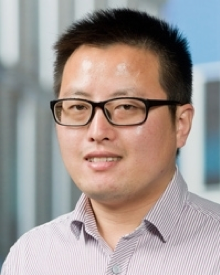

  

    
    

###Yuanhao Guo
- Ph.D Assistant
- National Laboratory of Pattern Recongition (NLRR)，Institute of Automation,Chinese Academy of Sciences
- Email: yuanhao.guo@ia.ac.cn

##### Academic Background
- Assistant Professor, Institute of Automation, Chinese Academy of Science, Jun. 2019-Presnet 
- Senior Computer Vision Engineer, DiDiChuXing AI Labs, Oct. 2018-May 2019
- Computer Vision Engineer, Navinfo Europe, Oct. 2017-Jun.2018
- Ph.D. in Imaging and Bioinformatics, Leiden University, Apr. 2014-Oct. 2017
- M.S. in Communication and Information System, Shandong University, Sep.2009-Jun.2012
- B.S. in Electronics Information Science & Technology, Qing University of Science & Technology, Sep.2005-Jun,.2009

##### Research Interests
The applications of machine learning (deep learning) and computer visions, such as classification, object detection and semantic segmentation; 3D modelling; Computational biology

##### Journal Papers
1. **Y. Guo**, Z. Xiong and F.J. Verbeek. "An efficient and robust hybrid method for segmentation of zebrafish objects from bright-field microscope images". Machine Vision and Applications, 29(8), pp. 1211-1225, Nov. 2018.
2. **Y. Guo**, R. Zhao, S. Wu and C. Wang. "Image capture pattern optimization for panoramic photography". Multimedia Tools and Applications, 77(17), pp. 22299-22318, Sept. 2018.
3. **Y. Guo**, Y. Zhang and F.J. Verbeek. "A two-phase 3D reconstruction approach for light microscopy axial-view imaging". IEEE Journal of Selected Topics in Signal Processing, 11(7), pp. 1034-1046, Oct. 2017.
4. **Y. Guo**, W. Veneman, H. Spaink, and F.J. Verbeek. "3D reconstruction and measurements of zebrafish larvae from high-throughput axial-view in vivo imaging". Biomedical Optics Express, 8(5), pp. 2611-2634, 2017.
5. **Y. Guo**, Y. Liu, E.M. Bakker, Y. Guo and M. Lew. "CNN-RNN: a large-scale hierarchical image classification framework". Multimedia Tools and Applications. 77(8), pp. 10251-10271, Apr. 2018.

##### Conference papers
1. **Y. Guo**, F. J. Verbeek, etc. "Multi-modal 3D reconstruction and measurements of zebrafish larvae and its organs using axial-view microscopy". In IEEE Conference on Image Processing, pp. 2194-2198. IEEE, 2017.
2. X. Tang, M. van't Hoff, J. Hoogenboom, **Y. Guo**, F. Cai, G. Lamers, and F.J. Verbeek. "Fluorescence and bright-field 3D image fusion based on sinogram unification for optical projection tomography." In IEEE International Conference on Bioinformatics and Biomedicine, pp. 403-410. IEEE, 2016.
3. **Y. Guo**, F.J. Verbeek, etc. "Silhouette-based 3D model for zebrafish high-throughput imaging." In IEEE Conference on Image Processing Theory, Tools and Applications, pp. 403-408. IEEE, 2015.
4. **Y. Guo**, H. Dibeklioglu, and L. van der Maaten. "Graph-based kinship recognition." In IEEE Conference on Pattern Recognition, pp. 4287-4292. IEEE, 2014.

##### Book Chapters
Chao Wang\*, **Yuanhao Guo**\* and Xubo Song (\* indicates equal contribution). "Head pose estimation via manifold learning". Manifolds-Current Research Areas, Prof. Paul Bracken (Ed.), InTech. Available from: http://www.intechopen.com/books/manifolds-current-research-areas/head-pose-estimation-via-manifold-learning

